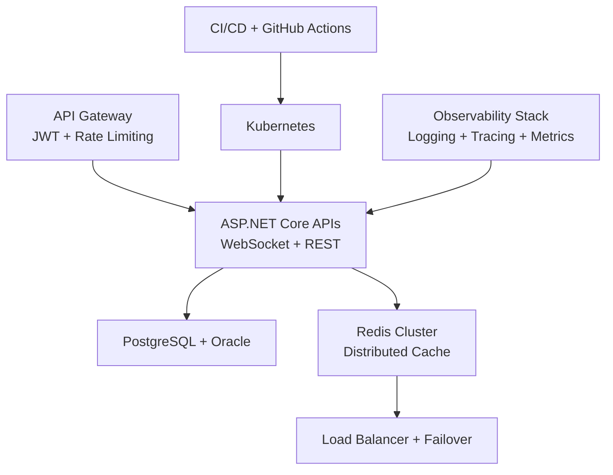
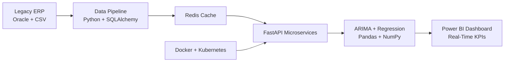
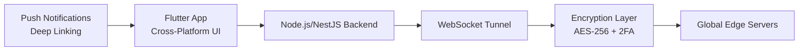
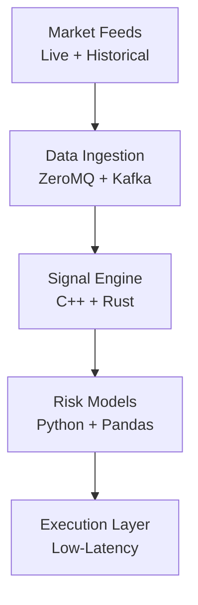
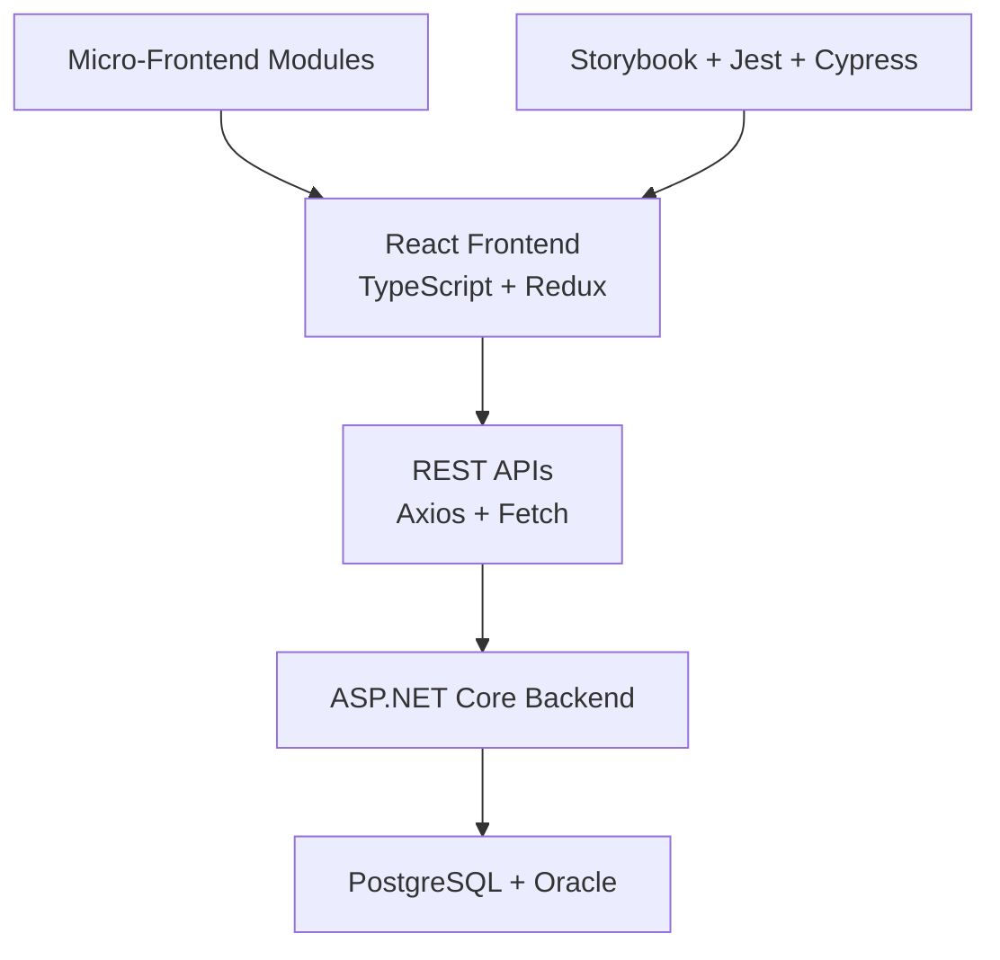

# Abdulhamit Kahya – Impact Portfolio
**Backend Tech Lead | 99.95% Uptime | Quant Finance | 100K-User VPN | Ex-Toptal**

> **Du To NDA  source code Show snipped Codes on Demand just. Only architecture, metrics, and vision from production systems.**
> I build systems that **run nations, save millions, and secure 100K+ users**.

---

## Nationwide Municipal Backend (70+ Councils)
**Kent Yazılım · 2025–Present · .NET Core, WebSocket, Redis, Kubernetes**

Impact Delivered:

99.95% uptime — reduced downtime by 75%
60% faster API response — enabled real-time citizen services
50% lower data breach risk — JWT, encryption, API Gateway
50% faster release cycles — CI/CD + serverless
45% faster incident response — observability stack
35% improved query efficiency — PostgreSQL + Oracle optimization
40% fewer unauthorized access incidents

Quant Finance Forecasting System
Belsoft · 2024–2025 · Python, FastAPI, Pandas, NumPy, ARIMA

Impact Delivered:

25% better revenue prediction accuracy
40% improved fiscal transparency across municipalities
60% less manual reconciliation — automated ERP imports
99.9% uptime during fiscal peaks
Report generation: days to minutes
40% better budget allocation & cash-flow prediction

Secure Mobile VPN (100K+ Active Users)
OceanBlue  2022–2023 · Flutter, Node.js, NestJS, AES-256

  Impact Delivered:
50% faster connection speed
30% higher user retention
40% fewer security vulnerabilities
35% fewer unauthorized access attempts
25% increased active session time
Live: https://hapivpn.com

High-Frequency Trading Infrastructure
Blackhouse · 2022–2024 · C++, Rust, Python, ZeroMQ

Impact Delivered:

40% faster trade execution — 30% lower latency
15% higher portfolio returns
20% lower drawdowns in volatile markets
35% faster model retraining
50% shorter deployment cycles via CI/CD
25% fewer production incidents

Full-Stack React Portals (30+ Councils)
Kent Yazılım · 2021–2022 · React, TypeScript, Redux, Tailwind

Impact Delivered:

70% faster UI responsiveness
30% reduced load time — React.lazy + code-splitting
45% higher user engagement
20% fewer network errors
25% fewer unauthorized access — JWT auth
55% faster live data updates via WebSocket

Early Backend Contributions

Kent Yazılım · 2020–2021 · .NET Core, Java, Android SDK

Enhanced API performance — 55% faster response via WebSocket + REST
Supported 99.9% uptime with distributed caching & load balancing
Reduced downtime by 66% via failover strategies
Implemented JWT auth — 35% fewer incidents
Co-developed MASKİ Android app — public services for thousands of users

LayerTechnologiesFrontendReact, Flutter, TypeScript, Redux, Tailwind, MUI, StorybookBackend.NET Core, Node.js, NestJS, Python, C++, RustDataPostgreSQL, Oracle, Redis, MongoDB, Pandas, NumPyInfraKubernetes, Docker, CI/CD, GitHub Actions, WebSocketSecurityJWT, AES-256, 2FA, Rate Limiting, EncryptionAPIsRESTful, WebSocket, JSON Web Tokens

Education
Erzincan Binali Yıldırım Üniversitesi
Computer Engineering · 2020 – 2024

References

Saffet Aydın – Kent Yazılım
+90 505 793 1300
Ahmad Saad Sadik – Oceablue 
+90 537 949 9858
Shadi othman
https://www.linkedin.com/in/shadi-alothman - Belsoft

Vision
I’m not here to write code.
I’m here to architect systems that scale nations, optimize economies, and secure the future.
